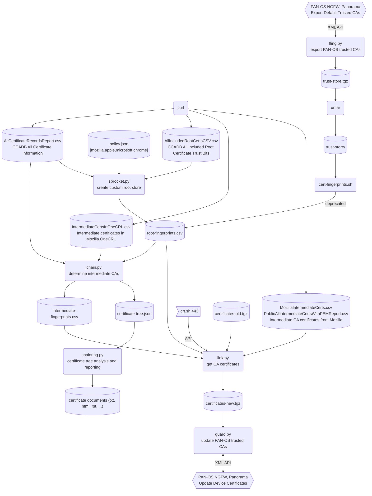

# pan-chainguard Data and Process Flow

```mermaid
flowchart TD
    panos{{"PAN-OS NGFW, Panorama<br/>Export Default Trusted CAs"}}
    panos2{{"PAN-OS NGFW, Panorama<br/>Update Device Certificates"}}
    truststore[(trust-store.tgz)]
    truststoredir[(trust-store/)]
    trustpolicy[("policy.json<br/>[mozilla,apple,microsoft,chrome]")]
    fling("fling.py<br/>export PAN-OS trusted CAs")
    sprocket("sprocket.py<br/>create custom root store")
    chain("chain.py<br/>determine intermediate CAs")
    link("link.py<br/>get CA certificates")
    guard("guard.py<br/>update PAN-OS trusted CAs")
	chainring("chainring.py<br/>certificate tree analysis and reporting")
    curl(curl)
    untar(untar)
    fingerprints(cert-fingerprints.sh)
    rootfingerprintscsv[(root-fingerprints.csv)]
    intfingerprintscsv[(intermediate-fingerprints.csv)]
	certificatetree[(certificate-tree.json)]
	treedocs[("certificate documents (txt, html, rst, ...)")]
    ccadb[("AllCertificateRecordsReport.csv</br>CCADB All Certificate Information")]
    roottrust[("AllIncludedRootCertsCSV.csv</br>CCADB All Included Root Certificate Trust Bits")]
    mozilla[("MozillaIntermediateCerts.csv</br>PublicAllIntermediateCertsWithPEMReport.csv</br>Intermediate CA certificates from Mozilla")]
    onecrl[("IntermediateCertsInOneCRL.csv</br>Intermediate certificates in Mozilla OneCRL")]
    crtsh>crt.sh:443]
    oldcertificates[(certificates-old.tgz)]
    newcertificates[(certificates-new.tgz)]

    panos<-->|XML API|fling
    fling-->truststore
    truststore-->untar
    untar-->truststoredir
    truststoredir-->fingerprints
    fingerprints-->|deprecated|rootfingerprintscsv
    curl-->ccadb
    ccadb-->chain
    curl-->roottrust
    curl-->onecrl
    onecrl-->chain
    trustpolicy-->sprocket
    ccadb-->sprocket
    roottrust-->sprocket
    sprocket-->rootfingerprintscsv
    rootfingerprintscsv-->chain
    chain-->intfingerprintscsv
	chain-->certificatetree
	certificatetree-->chainring
	chainring-->treedocs
    rootfingerprintscsv-->link
    intfingerprintscsv-->link
	curl-->mozilla
    mozilla-->link
    oldcertificates-->link
    crtsh-->|API|link
    link-->newcertificates
    newcertificates-->guard
    guard<-->|XML API|panos2
```
